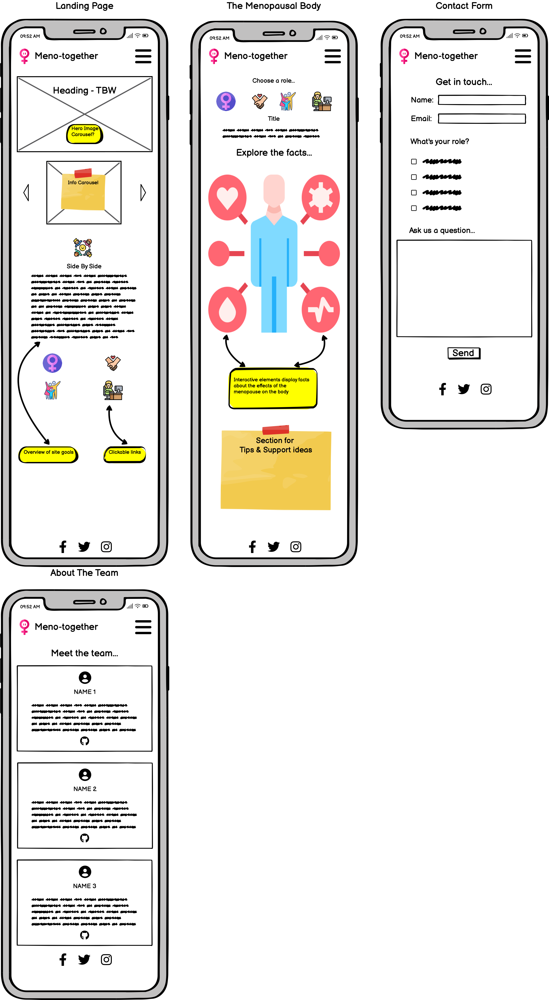

# FemHealthTogether

## Meno-Together 

**Overview**

Menopause affects anyone who menstruates, and refers to the phase of life when periods stop due to lower hormone levels. It usually happens between the ages of 45 and 55, but it can happen earlier. Perimenopause happens in the lead up to menopause - where periods haven't yet stopped (for at least 12 months), but there are symptoms of menopause. These symptoms can be difficult and confusing to deal with when they happen - e.g. anxiety, mood swings, hot flushes, brain fog and forgetfulness, dry skin.. to name but a few - and they can have a big impact on general life, relationships and work.

There is very little general knowledge available about it and unfortunately, it is often surrounded by misconceptions, stigma and lack of understanding, leading to those experiencing menopausal symptoms sometimes feeling embarrassed, isolated and unsupported during this transition. 

Partners, colleagues and friends may not know how to recognize the symptoms of menopause or how to provide effective support, resulting in potentially strained relationships and decreased quality of life for anyone experiencing menopause.

**Meno-Together** aims to provide information on different symptoms that may affect people during menopause (as well as perimenopause), in a friendly, upbeat and inclusive way that helps to engage all ages and backgrounds. It contains symptom information pages that can help not only those experiencing menopause, but their partners, friends, family, and work colleagues.

We have considered the use of our language, design and advice across the pages to be as neutral and inclusive as possible, highlighting that menopause affects not just those who identify as women, and also to appeal more broadly across different age groups. However, it must be stressed that this hackathon project was developed in a very short space of time, so there is more that we aim to do in future to make this a truly inclusive space with extra features of support.

As a team, we have recognised there is a lack of support and education for everyone involved when it comes to menopause, so the best approach for us to encourage positive change is to **"MAKE MENOPAUSE EASIER, TOGETHER".**

## Showcase

A **deployed link** to the live website can be found here [Menopause-Together Live Website](https://yemsala.github.io/FemHealthTogether/index.html)

## Developers

**Yemi Alade**
Role: Scrum Master & Team Coordinator
[GitHub](https://github.com/YemsAla) - [LinkedIn](https://www.linkedin.com/in/yemi-alade-ldn/)

**Erikas Ramanauskas**
Role: Lead Developer
[GitHub](https://github.com/Erikas-Ramanauskas) - [LinkedIn](https://www.linkedin.com/in/erikas-ramanauskas-full-stack-developer/)

**Georgina Carlisle**
Role: Content Curator & Developer
[GitHub](https://github.com/GeorginaCarlisle) - [LinkedIn](https://www.linkedin.com/in/georgina-carlisle-617b58268/)

**Tarah Waters**
Role: Lead Designer
[GitHub](https://github.com/tarahwaters) - [LinkedIn](https://www.linkedin.com/in/tarahwaters/)

**Rob Killick**
Role: UX/UI Lead
[GitHub](https://github.com/rkillickdev) - [LinkedIn](https://www.linkedin.com/in/rob-killick-7178262a/)

**Asif Hirani**
Role: Contact Page Magician
[GitHub](https://github.com/Asifhirani38) - [LinkedIn](https://www.linkedin.com/in/asif-hirani-complianceofficer/)

**Stefan Ruppe**
Role: Accessibility Advocate & Bug Buster
[GitHub](https://github.com/CsClown/) - [LinkedIn](https://www.linkedin.com/in/stefan-ruppe/)

## Product Vision

Meno-Together aims to bridge the current gap in understanding and support for people going through menopause by providing comprehensive information and resources for partners & other surrounding groups, such as colleagues and friends. 
The platform will serve as a one-stop destination for education, empathy and practical tips to help loved ones navigate this significant life transition together.

## Features (MVP)

1. Interactive Body Diagram

   - Users will be greeted with an interactive diagram of a female body, highlighting different areas affected by menopause
   - Clicking on specific body parts will reveal information about the associated symptoms, how common they are and possibly the stage of menopause

- A body diagram and symptoms page per persona (you/partner/friends&family/colleague)

2. Symptom Details

   - Each clickable area should provide detailed information about the symptom including its prevalence, the stage of menopause it commonly occurs in and its impact on the body.
   - Brief descriptions tailored for partners, colleagues and friends should help them understand what people are experiencing during menopause.

3. Supportive Tips

   - Practical tips and suggestions will be provided to advise how best to support someone through their menopausal journey.
   - These tips will cover everything from lifestyle changes to effective communication, aimed at easing symptoms and fostering understanding.

## Features (post MVP)

4. Resource Library/Information Hub

   - A comprehensive resource library will offer additional information, via articles, videos, and external links for those looking for more in-depth knowledge about menopause.

5. Menopause Tracker

- Provide a brief overview of the stages of menopause, including perimenopause, menopause, and postmenopause on a visual scale
- Integrates with an assessment tool where users can input information about age, menstrual status and symptoms. Based on the inputs, the tool provides an estimate of which stage of menopause the user may be in and offer relevant information and resources.

6. Community forum - post MVP

 - A community forum will allow users to connect with others in similar situations, share experiences and offer support.

   - Moderated by healthcare professionals and menopause experts, the forum will provide a safe space for open discussion and mutual encouragement.

## **User Stories**

### Epic - Navigation

1 - As a user, a clear navigation bar is present throughout the site, so that I can navigate easily between different pages.

### Epic - Landing Page

2 - As a new user, I can instantly see what the website is about, so that I can understand the value that it may offer me.

### Epic - Contact us

3 - As a user, a contact form is available, so that I can contact the site to request further information.

4 - As a user, a clear success message is displayed on submitting the form, so that I know my message has been successful.

### Epic - The Menopausal Body

5 - As a user, I can view an image of a womans body which highlight's the different areas affected by menopause, so that I can understand all the ways in which the menopause can affect a women.

6 - As a user, I can click on a different area of the body to bring up further information, so that I can learn more about a specific symptom.

7 - As a user, I can read information on the different symptoms of menopause, so that I can learn more about the effects of menopause.

8 - As a user, I can pick up suggestions of how to support a women going through menopause, so that I can support Women who I know you are going through menopause.

### Epic - About the team

9 - As a user, I can read about the team and why this website has been created, so that I can learn the story behind the site.

10 - As a user, I can click to visit the LinkedIn and Github pages for the developers that created the site, so that I can find out more about them and connect should I wish.

## **Wireframes**

Wireframes were created using [Balsamiq](https://balsamiq.com/wireframes/) and used as a blueprint for development of the site layout and structure.

These evolved slightly throughout the planning phase.  The first draft can be viewed [here](docs/wireframes/meno-together-mobile-draft1.png)

## Tools and Technologies Used:

- **HTML5**
- **CSS**
- **Bootstrap**
- **JavaScript**

- [GitHub and Github Pages](https://github.com/) - used to securely store the code and to host and deploy the live project
- [GitPod](https://www.gitpod.io/) - used as a cloud-based IDE for development
- [Chrome Developer Tools](https://developer.chrome.com/docs/devtools/) - used for testing and troublshooting code, along with Lighthouse auditing
- [Balsamiq](https://balsamiq.com/wireframes/) - used to create wireframes during project planning
- [redketchup.io](https://redketchup.io/) - used for resizing and converting image files to webp format
- [Canva](https://www.canva.com/) - used to create logo, hero images
- [Coolors](https://coolors.co/) - used to generate a color palette for the website design
- [TinyPNG](https://tinypng.com/) - converting and compressing images
- [FontJoy](https://fontjoy.com/) - used to generate visually appealing font pairings for  the website
- [AmIResponsive?](https://ui.dev/amiresponsive?url=https://tarahwaters.github.io/milestone-project2/) - used to create a mockup of the website
- [PhotoPea](https://www.photopea.com/) - used to remove backgrounds and editing of images

## Credits
- [Adobe Stock Images](https://stock.adobe.com/uk/search/images?filters%5Bcontent_type%3Azip_vector%5D=true&hide_panel=true&k=body+outline&search_type=usertyped&asset_id=740103554) - for body diagram image
- [Flaticon icons](https://www.flaticon.com/authors/basic-accent/lineal-color) - colourful link icons ('basic accent lineal color' style) made by [Freepik](https://www.freepik.com/) and accessible through Flaticon, free for usage with credit reference

## References

- Source: British Menopause Society, "Menopause Matters" (2020). [Link - https://www.britishmenopausesociety.org/menopause-faqs/]

- Source: Fiona Clark, Medium Blogpost, "Could it be Menopause? With more than 30 symptoms it can sometimes be hard to tell" (2020). [Link - https://medium.com/@info_30745/could-it-be-menopause-with-more-than-30-symptoms-it-can-sometimes-be-hard-to-tell-eeb399e2eaa2]

- Source: Forth With Life, "How to support your partner through perimenopause" (2023). [Link: https://www.forthwithlife.co.uk/blog/how-to-support-your-partner-through-perimenopause/]

- Source: National Institute for Health and Care Excellence (NICE), "Menopause: Diagnosis and Management" (2015). [Link - https://www.nice.org.uk/guidance/ng23]

- Source: NHS (National Health Service), "Menopause" (2021). [Link - https://www.nhs.uk/conditions/menopause/]

- Source: NHS Inform Scotland, "Menopause and the Workplace" (2023). [Link - https://www.nhsinform.scot/healthy-living/womens-health/later-years-around-50-years-and-over/menopause-and-post-menopause-health/menopause-and-the-workplace/]

- Source: NHS Inform Scotland, "Supporting someone through the menopause" (2023). [Link - https://www.nhsinform.scot/healthy-living/womens-health/later-years-around-50-years-and-over/menopause-and-post-menopause-health/supporting-someone-through-the-menopause//]

- Source: Royal College of Obstetricians and Gynaecologists (RCOG), "Menopause" (2016). [Link - https://www.rcog.org.uk/en/patients/menopause/]

- Source: Menopause UK, "The Menopause Survey 2020". [Link - https://www.menopauseuk.org/for-women/menopause-awareness/menopause-uk-survey-2020]

- Reference for inclusivity: Article: Inclusive Language and the Menopause (GenderGP Transgender Services) [Link - https://www.gendergp.com/blog-menopause-inclusivity/]

- Reference for inclusivity: Clinic Blog Post: LGBTQ+ inclusivity and menopause (The Surrey Park Clinic) [Link - https://thesurreyparkclinic.co.uk/lgbtq-health-menopause/]